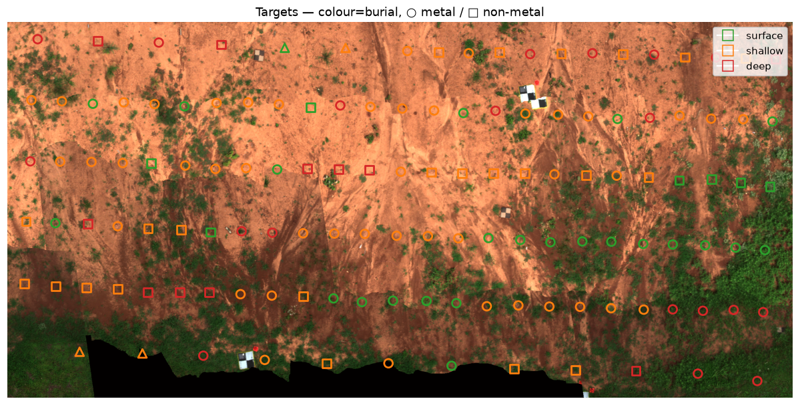
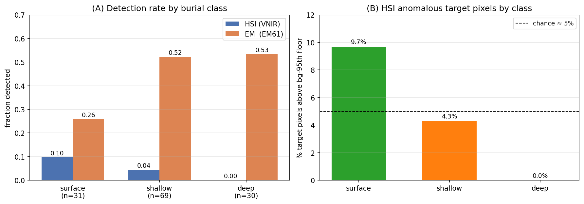
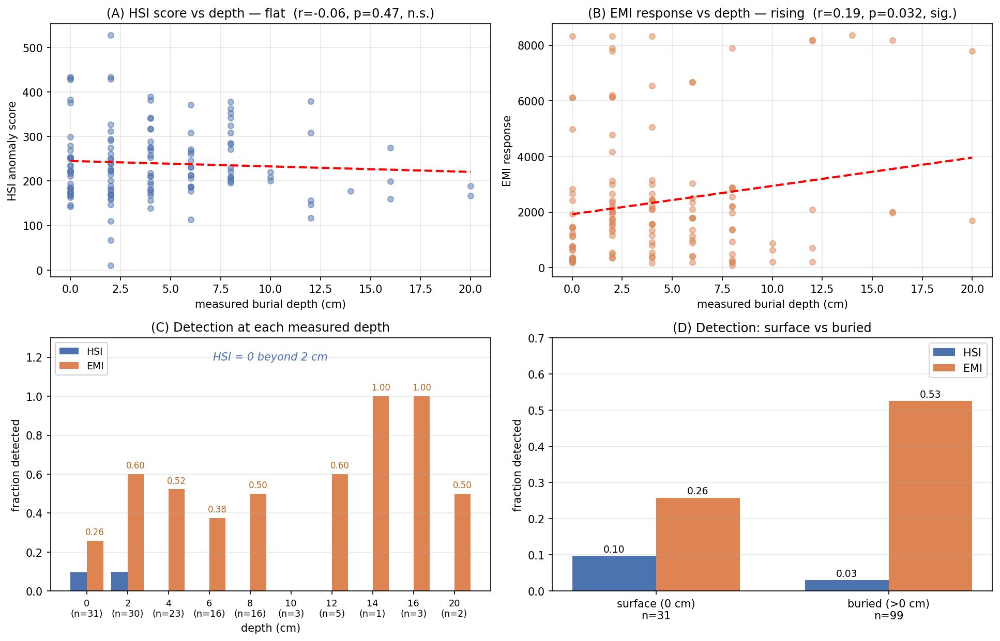
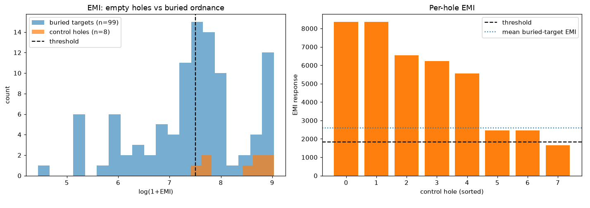

# HSI-EMI Buried Target Detection

Depth and material-resolved comparison of **VNIR hyperspectral imaging (HSI)** and **EM61-Lite electromagnetic induction (EMI)** for buried-target detection on the RIT/DIRS DRC Site 2 seeded field.

## Overview

This project compares how HSI and EMI respond to the same buried targets as burial depth changes. The analysis uses **130 targets covered by both sensors** and evaluates depth in two ways:

1. **Burial classes:** surface, shallow, and deep  
2. **Continuous depth:** exact measured burial depth in centimeters

The main goal is to determine whether the sensors show real depth-dependent behavior and whether they provide complementary information.



## Data

The project uses:

- **VNIR hyperspectral cube:** 6631 × 3123 × 272 bands, approximately 398–1002 nm
- **HSI analysis range:** 400–900 nm
- **EM61-Lite survey:** 2042 georeferenced readings
- **Ground-truth table:** 150 rows
  - 131 real seeded targets
  - 8 empty control holes
  - 11 blank/placeholder rows
- **Paired HSI–EMI comparison:** 130 targets

### Dataset Availability

All datasets used in this project are available on Zenodo:

**[Download the project datasets from Zenodo](https://zenodo.org/records/19100554)**

After downloading, place the required hyperspectral, target-metadata, spectral-signature, calibration, GCP, and EM61 files in the project directory following the repository structure below.

## Methods

### Hyperspectral Imaging

The HSI pipeline uses local-background processing and several target/anomaly detectors:

- Spectral Angle Mapper (**SAM**)
- Matched Filter (**MF**)
- Adaptive Cosine Estimator (**ACE**)
- RX anomaly detection

A 31-pixel local background is used so that each target is evaluated relative to its immediate surroundings.

### Electromagnetic Induction

For each target, the strongest leveled EM61 Channel 1 response within **1 meter** is used.

Detection thresholds are background-relative:

- **HSI:** 95th percentile of background RX anomaly
- **EMI:** 90th percentile of survey response

## Experiments

### Experiment 1: Burial Classes

Targets are grouped as:

- **Surface:** 0 cm
- **Shallow:** ≤ 6 cm
- **Deep:** > 6 cm

| Burial class | HSI detection | EMI detection |
|---|---:|---:|
| Surface | 0.10 | 0.26 |
| Shallow | 0.04 | 0.52 |
| Deep | 0.00 | 0.53 |



The grouped analysis appears to show HSI decreasing with depth and EMI increasing.

### Experiment 2: Continuous Depth

Using exact burial depth gives a more reliable picture:

- **HSI:** r = -0.06, p = 0.47 → no significant relationship with depth
- **EMI:** r = 0.19, p = 0.03 → significant positive relationship with depth



This shows that the apparent HSI depth trend from Experiment 1 is mainly an artifact of binning, while the EMI trend remains.

## Key Findings

- HSI detected **6/130 targets (5%)**.
- EMI detected **60/130 targets (46%)**.
- HSI showed **no significant continuous relationship with burial depth**.
- EMI response **increased significantly with burial depth**.
- HSI target spectra were very similar to the surrounding soil, indicating **low spectral contrast**.
- EMI showed little separation between metal and non-metal targets.
- Empty control holes produced stronger EMI responses than many real buried targets, suggesting that EMI may be strongly responding to **soil disturbance**.

### Empty-Hole Control

| Group | Mean EMI response | Detection rate |
|---|---:|---:|
| Empty control holes | 5204 | 0.88 |
| Real buried targets | 2601 | 0.53 |

Mann–Whitney test: **p = 0.006**



## Interpretation

The results do not support a simple “HSI works near the surface while EMI takes over at depth” explanation.

Instead:

- **EMI performs most of the localization/detection**
- **HSI is weak at nearly all depths on this field**
- EMI may be sensitive to **disturbed soil**, not only target material
- HSI still provides spectral information that EMI cannot provide

This makes **HSI + EMI sensor fusion** a promising direction for future work.

## Repository Structure

```text
.
├── HSI analysis.ipynb
├── HSI–EMI comparison.ipynb
├── EO_properties_and_Locations_field2.csv
├── GCP_points.csv
├── elm_corrected_vnir
├── elm_corrected_vnir.hdr
├── elm_corrected_vnir.cff
├── Metal Detector EM61 Lite Data/
├── Spectral_Signatures_of_Targets/
├── figures/
└── results_*/
```

### Notebooks

- **`HSI analysis.ipynb`** — detailed HSI analysis, spectral references, SAM/MF/ACE evaluation, georeferencing checks, and Pd-vs-FAR analysis.
- **`HSI–EMI comparison.ipynb`** — final HSI–EMI comparison, burial-depth experiments, material analysis, and empty-hole control experiment.

## Installation

Create an environment:

```bash
conda create -n hsi-emi python=3.11 -y
conda activate hsi-emi
```

Install the main dependencies:

```bash
pip install numpy scipy pandas matplotlib scikit-learn spectral rasterio tqdm openpyxl jupyter
```

Optional NVIDIA GPU support:

```bash
pip install cupy-cuda12x
```

## Running the Project

1. Download the datasets from **[Zenodo](https://zenodo.org/records/19100554)**.
2. Place the downloaded data files in the project directory.
3. Update `DATA_DIR` in the notebooks to your local project path.
4. Run `HSI analysis.ipynb` for the detailed HSI analysis.
5. Run `HSI–EMI comparison.ipynb` for the final HSI–EMI comparison.

Example:

```python
DATA_DIR = "/path/to/your/project"
```

## Limitations

- SVC reference spectra are available for only **69 of 131 targets**.
- Burial depths are concentrated toward shallow values.
- Only **8 empty control holes** are available.
- The 6 cm shallow/deep boundary is a chosen analysis threshold.
- The soil-disturbance interpretation should be validated on additional data.

## Future Work

- HSI–EMI sensor fusion
- SWIR hyperspectral analysis
- disturbed-soil spectral detection
- improved target/reference spectra
- evaluation on additional seeded fields

## Acknowledgements

This project analyzes co-registered VNIR hyperspectral and EM61-Lite measurements from the RIT/DIRS DRC Site 2 seeded field.

Please verify the original dataset license and attribution requirements before redistributing the raw data.
